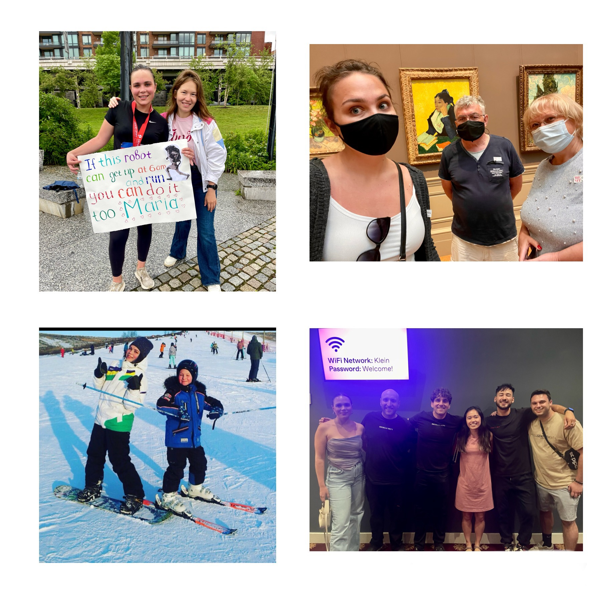

About
======
Hello! My name is Mariia, and I am a Machine Learning Engineer currently working at the Food and Drug Administration (FDA). My doctoral research focused on the application of generative models for the identification of atypical functional connectivity in fMRI data. My FDA research projects involve developing unsupervised clustering algorithms for identification of hidden domains in medical imaging. **Looking for a full-time Machine Learning position.** 

When I am not coding or drafting a paper, I love to run, snowboard, explore art, and attend stand-up shows.

  

Resume *(last updated January 2024)*
======
[Download Mariia's Resume](/files/resume.pdf) 
[Download Mariia's CV](/files/cv.pdf) 

Currently Reading
=================
"A People's History of the United States" by Howard Zinn 
"The Brothers Karamazov" by Fyodor Dostoevsky 

Currently Listening to
=======================
[Morning Brew Daily](https://www.youtube.com/@MorningBrewDailyShow) 
[PLÜM - Just One Dance (feat. Tanaë)](https://www.youtube.com/watch?v=U-9r_REkZqQ) 