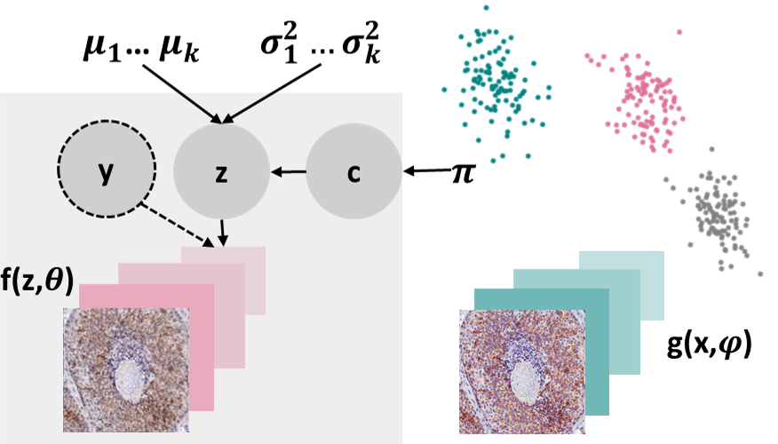



DomId Python librarys
====

  

  
DomId, a Python library currently in its final stages of development, specializes in deep clustering methods tailored for image analysis, with a particular focus on clustering digital pathology images. The library encompasses three deep learning clustering algorithms, including Variational Autoencoder-based Deep Embedding (VADE), Deep Embedded Clustering (DEC), and Structural Deep Clustering Network (SDCN).

The primary objective of this Python package is to explore whether incorporating already known attribute labels of images enhances the models' ability to find hidden or unannotated subgroups within the dataset. Additionally, one can investigate the impact of including spatial information (if there is any) through graph neural networks.

:floppy_disk: [GitHub repo](https://github.com/DIDSR/DomId.git)  
:notebook: [Documentation website](https://didsr.github.io/DomId/build/html/index.html)  
:page_with_curl: [Manuscript](https://doi.org/10.1007/978-3-031-43993-3_64)  
:page_with_curl: (*another manuscript is in review*)   

Ultimate Must-See Movie List Aggregator
====
This Jupyter Notebook project is all about creating the ultimate must-watch movie list! Using some web-scraping magic, it pulls in suggestions from different corners of the internet and compiles them into a consolidated list. I am contunuously working on this project and trying to make my own personalized movie recommendation system :popcorn: .  
:floppy_disk: [GitHub repo](https://github.com/sidulova/UltimateMustSeeMovieList.git)  
