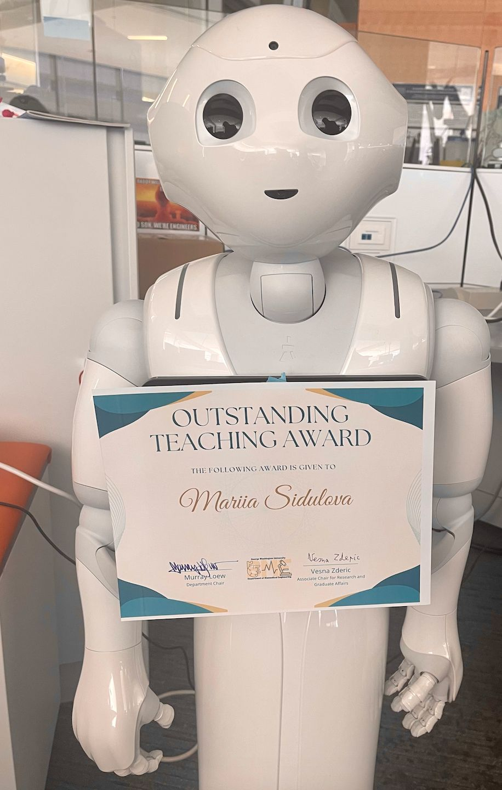



  

George Washington University
=====
**Capstone/Senior Design Class for Biomedical Engineering Department | [LinkedIn Post](https://www.linkedin.com/posts/activity-6923672973652504576-K9w7?utm_source=share&utm_medium=member_desktop) | Fall 2019 - Spring 2022**  
 * Guided 8 - 10 team projects through the process of engineering medical devices for real world clients
 * Introduced students to principles of SCRUM project management, product development, and customer discovery
 * Assisted students with Python, SolidWorks, 3D printing, microcontrollers, circuit design, and digital signal processing

**Physiology Lab for Biomedical Engineering Department | Fall 2021**  
 * Guided students in performing a variety of physiological experiments, fostering a deep understanding of human anatomy and physiology. 
 * Pioneered the transition of the physiology lab to a virtual setting during the COVID-19 pandemic, ensuring continuous learning for students. 

University of Minnesota
========================
**Calculus and Pre-calculus Classes for Math Department | Spring 2016 - Spring 2019**
  * Organized and led weekly recitation sessions for ~60 students/semester
  * Graded homework, exams, quizzes and reported statistics of students’ performance
  * Hosted office hours and appointment-based tutoring sessions
